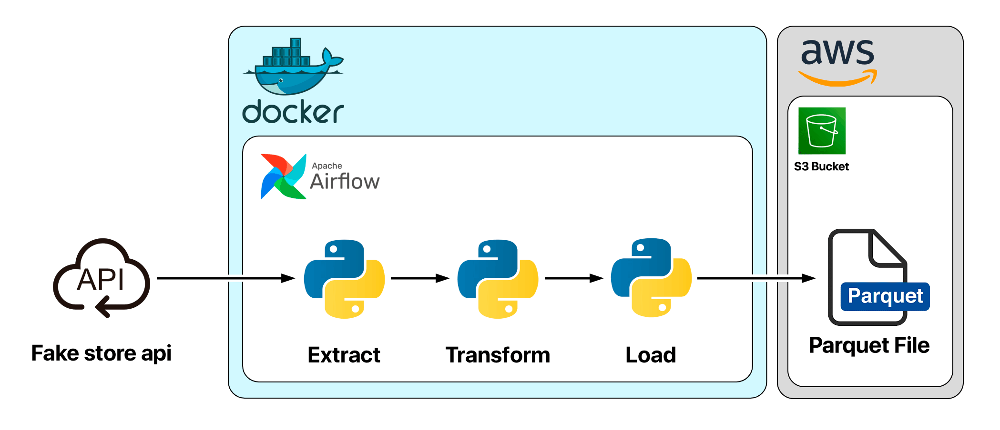

# 🛠️ ETL Pipeline com Airflow, Docker, Python e AWS S3

### 🚀 Extração de dados → Transformação → Geração de Parquet → Upload para o S3 → Limpeza local



Este projeto implementa um pipeline ETL completo usando **Apache
Airflow**, totalmente orquestrado em **Docker**, com tarefas escritas em
**Python** para extrair dados da *Fake Store API*, transformar em
DataFrames padronizados e salvar em arquivos **Parquet** compactados.

Posteriormente, os arquivos são enviados automaticamente para um
**bucket S3**, e em seguida removidos do ambiente local para manter o
diretório limpo.

Ideal para demonstração prática de uma **pipeline real de Engenharia de
Dados**, com boas práticas e separação de etapas.

------------------------------------------------------------------------

## 📌 Arquitetura Geral

-   **Extract:**
    -   `/users`, `/products` e `/carts`
    -   Requests HTTP com tratamento de erros
-   **Transform:**
    -   Padronização de colunas\
    -   Normalização de estruturas aninhadas\
    -   Criação de colunas `created_at` e `updated_at`\
    -   DataFrames consistentes por entidade
-   **Load (Local):**
    -   Geração de arquivos Parquet (`.snappy`) dentro do diretório
        `data/`
-   **Load (S3):**
    -   Upload automático de todos os arquivos do diretório `data/` para
        o bucket\
    -   Armazenamento em pastas com data (`YYYY-MM-DD/arquivo.parquet`)
-   **Clean Up:**
    -   Exclusão dos arquivos locais após upload

------------------------------------------------------------------------

## 🧰 Tecnologias Utilizadas

-   **Python 3.10+**\
-   **Apache Airflow (TaskFlow API)**\
-   **Docker & Docker Compose**\
-   **AWS S3 com boto3**\
-   **Requests**\
-   **Pandas**\
-   **PyArrow**\
-   **dotenv (.env)**

------------------------------------------------------------------------

## 📂 Estrutura do Código

O DAG possui 5 tarefas principais:

### 1️⃣ `etl_users()`

-   Extrai dados de `/users`
-   Normaliza campos aninhados (`name`, `address`)
-   Gera arquivo `{data}-USER.parquet`

### 2️⃣ `etl_products()`

-   Extrai dados de `/products`
-   Renomeia colunas
-   Gera arquivo `{data}-PRODUCT.parquet`

### 3️⃣ `etl_carts()`

-   Extrai `/carts`
-   Desnormaliza listas de produtos dentro de cada carrinho
-   Gera `{data}-CARTS.parquet`

### 4️⃣ `send_to_s3()`

-   Lê todos os arquivos dentro de `data/`
-   Envia para o bucket S3 configurado no `.env`

### 5️⃣ `delete_local_files()`

-   Apaga arquivos locais após upload (trigger: *all_success*)

------------------------------------------------------------------------

## ▶️ Fluxo do DAG

    etl_users()
        >> etl_products()
        >> etl_carts()
        >> send_to_s3()
        >> delete_local_files()

------------------------------------------------------------------------

## ▶️ Como Executar o Projeto

### 1️⃣ Criar arquivo `.env`

Exemplo:

    aws_access_key_id=SEU_ID
    aws_secret_access_key=SUA_KEY
    aws_region=us-east-1
    bucket_name=meu-bucket
    user_email=seu@email.com

### 2️⃣ Subir o ambiente Airflow:

``` bash
docker-compose up -d
```

### 3️⃣ Acessar:

    http://localhost:8080
    Usuário: airflow
    Senha: airflow

### 4️⃣ Ativar o DAG:

`etl_pipeline`

------------------------------------------------------------------------

## 📁 Estrutura Final do Repositório

    ├── dags/
    │   └── etl_pipeline.py
    ├── data/   # criado automaticamente
    ├── diagrams/
    │   └── ERM.pdf
    ├── .env
    ├── docker-compose.yml
    ├── pipeline_etl.png
    └── README.md

------------------------------------------------------------------------

## 🎯 Objetivos do Projeto

-   Demonstrar domínio em pipelines ETL modernos\
-   Criar ETL real, funcional e automatizado\
-   Trabalhar com APIs, normalização e Parquet\
-   Integrar Airflow + AWS S3\
-   Criar portfólio forte para LinkedIn/GitHub

------------------------------------------------------------------------

## 🔧 Possíveis Evoluções

-   [ ] Camadas bronze/silver/gold\
-   [ ] Testes automatizados\
-   [ ] Validações com Great Expectations\
-   [ ] CI/CD com GitHub Actions\
-   [ ] Scheduler diário\
-   [ ] Dashboard com Athena + QuickSight

------------------------------------------------------------------------

## 🤝 Contribuições

Sugestões, melhorias e PRs são bem-vindos!

---

## 👨‍💻 Autor

Dilley Andrade
Engenheiro de Dados | SQL | ETL | Python — Focado em soluções de dados, ETL, BI e engenharia de dados.
(81) 98663-2609 | dilleyandrade@gmail.com | http://linkedin.com/in/dilleyandrade | http://github.com/DilleyAndrade 

---
# ETL-Pipeline-com-Airflow-Docker-Python-e-AWS-S3
